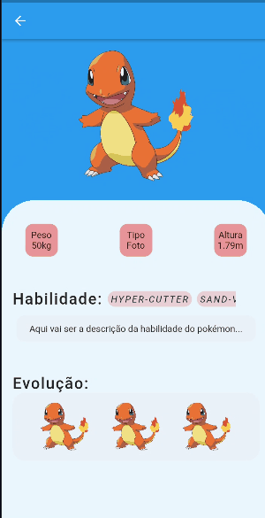

# Flutter | Módulo 01 - PokéAPI

<h1 align="center">

  <!--  -->
   Pokémon App 
</h1>

 Exibindo Lista de habilidades do Pokémon com MVC

  

  

[//]: # (Adicione seus gifs / imagens aqui:)

 
   

<!-- 

   
   
  

 -->

<!-- ## **Informações:** -->
[//]: # (Descreva seu objetivo e o que foi usado no projeto:)

<!-- * Projeto criado com objetivo de desenvolver habilidades no desenvolvimento de aplicativos com Flutter.
* Minha principal dificuldade no desenvolvimento do projeto, foi fazer a recuperação dos dados para serem exibidos na tela.
* Foi usado estrutura `MVC + SetState` no projeto.
* OBS: Este projeto, não foi otimizado para IOs, porém pode rodar normalmente. -->

<!-- - **[THE MOVIE DB: Api](https://developers.themoviedb.org/3/getting-started/introduction)** - Foi usado API na requisição da lista de filmes, para serem consumidas no APP.  -->

<!-- ## **Em breve:** -->
[//]: # (Descreva aqui se o app ainda esta em contrução:)

<!-- * Feature `MVVM`
* Feature `Streams`
* Feature `Paginação` -->

<!-- ## **How to reach me:**
[//]: # (Adicione suas redes:)

[Instagram - Pessoal](https://www.instagram.com/dannbrandao_)

 -->

## **Linguagens e Ferramentas:**
[//]: # (Adicione os recursos do seu projeto aqui:)

- <code></code> **Flutter**
- <code></code> **Dart**

<!-- ## Iniciar Projeto -->
[//]: # (Descreva aqui a forma de usar / instalar seu projeto:)

<!-- 1° Clone este repo usando: git clone `https://github.com/brandaoti/movie-app.git`  
2° Mova-se para o diretório apropriado: `cd movie-app`  
3° digite `flutter run` para instalar as dependência e apk   -->

<!-- * ### IMPORTANTE: antes do 3° passo, <strong>conectar um aparelho físico via cabo ou emulador</strong>. -->
        

<!-- ## License

 Este projeto está licenciado sob a Licença MIT - consulte a [LICENSE](https://choosealicense.com/licenses/mit/) página para detalhes. -->
